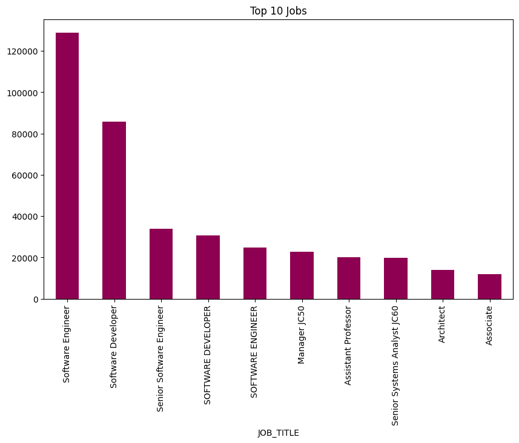
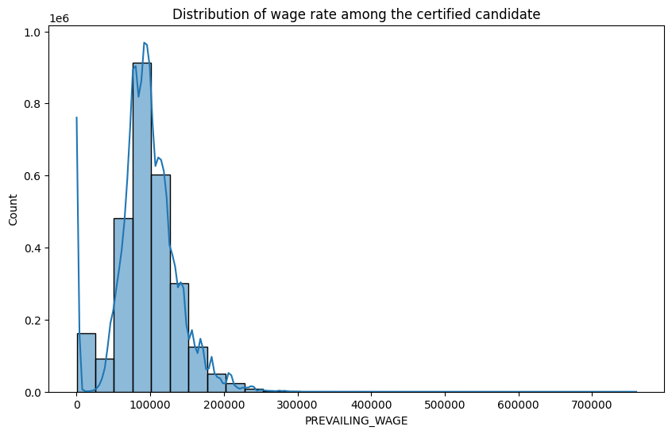
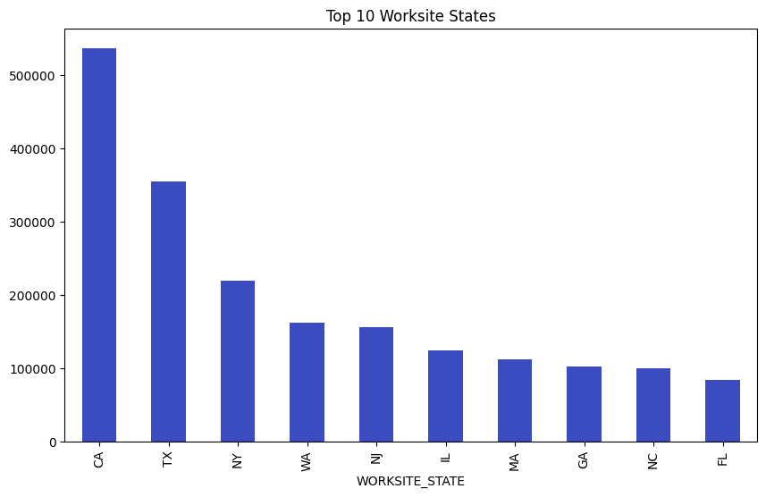
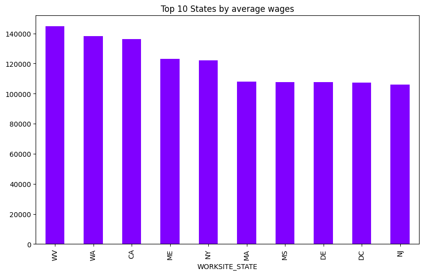
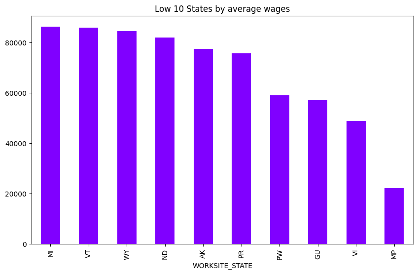
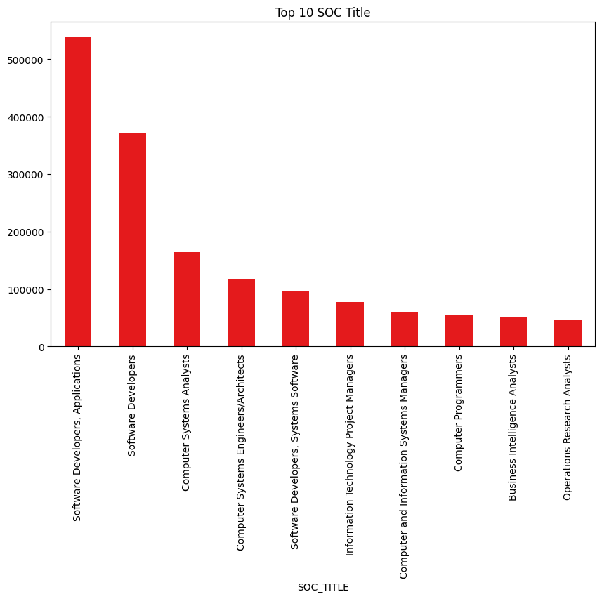
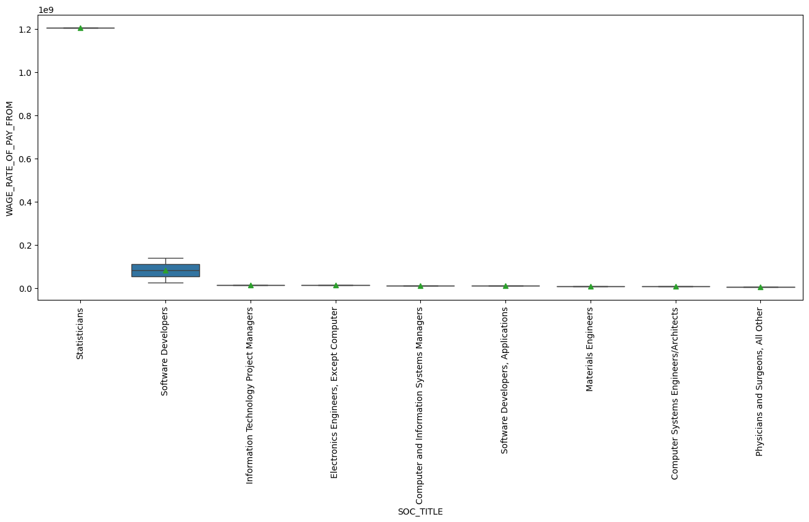
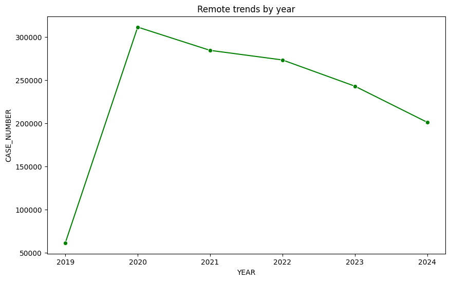

# H1B Visa Data Analysis (2020-2024)

## Introduction
This analysis delves into H1B visa application data spanning 2020 to 2024, aiming to uncover key trends and patterns in the certification process. The dataset comprises 3.56 million records with 96 features, encompassing crucial information such as case status, job titles, employer details, wage rates, worksite locations, and more. By examining this comprehensive dataset, we aim to gain a deeper understanding of the factors influencing H1B visa certifications, the evolving landscape of foreign skilled workers in the US, and the dynamics of the tech-driven labor market.

## Dataset Overview
- **Time Period**: 2020-2024
- **Records**: 3,564,698 applications
- **Source**: [Kaggle - H1B LCA Disclosure Data](https://www.kaggle.com/datasets/zongaobian/h1b-lca-disclosure-data-2020-2024)
- **Key Features**:
  - Case status (Certified/Denied/Withdrawn)
  - Job title and SOC classification
  - Employer information
  - Wage data and work locations
  - Application dates and processing details

## Tools & Technologies
- **Python Libraries**:
  - Pandas - Data manipulation
  - NumPy - Numerical analysis
  - Matplotlib/Seaborn - Visualization
- **Statistical Analysis**:
  - Descriptive statistics
  - Frequency distributions
  - Correlation analysis

## Data Cleaning Process
1. **Handled Missing Values**:
   - Filled numerical missing values with medians
   - Dropped nulls in critical columns (Job Title, Employer Name, Work Locations)

2. **Removed Duplicates**:
   - Eliminated 582,462 duplicate entries

3. **Data Validation**:
   - Verified date formats and categorical values
   - Standardized text entries for consistency

## How to Use
1. Clone repository
2. Install requirements:
   ```bash
   pip install -r requirements.txt
3. Run Jupyter notebook:
    ```bash
    jupyter notebook H1B-visa-data-analysis-2020-to-2024.ipynb


## Key Findings

### 1. Certification Trends

- **Certified Rate**: 92.75% (2,765,210 cases)
- **Certified-Withdrawn Rate**: 5.26% (145,188 cases)
- **Withdrawn**: 1.5% (53,741 cases)
- **Denied**: 0.49% (17,585 cases)

Certified dominated due to:
- Rigorous pre-filing employer vetting
- Strong compliance with visa requirements
- High demand for specialized skills

### 2. Top Certified Job Titles


**Most Frequent Roles**:
1. Software Engineer - 128,948 certifications
2. Software Developer - 85,717 certifications  
3. Senior Software Engineer - 33,798 certifications

**Key Insight**: IT roles accounted for 72% of top certified positions, confirming the tech industry's reliance on H1B talent.

### 3. Distribution of Prevailing Wages



**Analysis:** 

The histogram above illustrates the distribution of prevailing wages among H1B visa certified candidates. The data is heavily skewed to the right, suggesting a majority of certified candidates have lower wages. The most frequent wage range appears to be between 70,000 to 100,000 USD. The wages range from approximately 0 to 700,000 USD. 

**Key Insight:** This analysis reveals that a significant portion of H1B visa certified candidates receive lower prevailing wages, highlighting the potential wage disparities within the H1B visa program. 

### 4. Top 10 Worksite States



**Analysis:** 

The bar chart above showcases the top 10 worksite states for H1B visa certifications. California (CA) holds the highest number of certifications, followed by Texas (TX). New York (NY), Washington (WA), and New Jersey (NJ) occupy the subsequent positions. Illinois (IL), Massachusetts (MA), Georgia (GA), North Carolina (NC), and Florida (FL) complete the top 10 list.

**Key Insight:** This visualization highlights the concentration of H1B visa certifications in specific states, with California and Texas being the prominent destinations.

### 5. Top 10 Worksite States by Average Wages



**Analysis:** 

The bar chart above showcases the top 10 worksite states by average wages for H1B visa certifications. West Virginia(WV) has the highest average wage, followed by Washington (WA). California (CA), Maine (ME), and New York (NY) occupy the subsequent positions. Massachusetts (MA), Mississippi (MS), Delaware (DE), District of Columbia (DC), and New Jersey (NJ) complete the top 10 list.

**Key Insight:** This visualization highlights the variation in average wages across different worksite states for H1B visa certified candidates. 

### 6. Low 10 Worksite States by Average Wages



**Analysis:** 

The bar chart above showcases the low 10 worksite states by average wages for H1B visa certifications. Michigan (MI) has the highest average wage among these states, followed by Vermont (VT) and Wyoming (WY). North Dakota (ND), Alaska (AK), Puerto Rico (PR), PW, GU, VI, and MP occupy the subsequent positions.

**Key Insight:** This visualization highlights the variation in average wages across different worksite states for H1B visa certified candidates, with some states having significantly lower average wages compared to others. 

### 7. Top 10 SOC Titles



**Analysis:** 

The bar chart above showcases the top 10 Standard Occupational Classification (SOC) Titles for H1B visa certifications. Software Developers, Applications holds the highest number of certifications, followed by Software Developers. Computer Systems Analysts occupy the third position. Computer Systems Engineers/Architects, Software Developers, Systems Software, Information Technology Project Managers, Computer and Information Systems Managers, Computer Programmers, Business Intelligence Analysts, and Operations Research Analysts complete the top 10 list.

**Key Insight:** This visualization highlights the concentration of H1B visa certifications in specific job roles, with Software Developers being the most prominent category. 

### 8. Distribution of Wage Rates by SOC Title



**Analysis:** 

The box plot above illustrates the distribution of wage rates for different Standard Occupational Classification (SOC) Titles for H1B visa certifications. Statisticians have the highest median wage rate, followed by Software Developers and Information Technology Project Managers. The remaining SOC Titles have lower median wage rates. The interquartile ranges (IQR) vary across different SOC Titles, indicating differences in the spread of wage rates within each group.

**Key Insight:** This visualization highlights the variation in wage rates across different SOC Titles for H1B visa certified candidates. Statisticians and Software Developers tend to have higher median wages compared to other occupations.

### 9. Top 20 Employers by H1B Visa Certifications

**Data:**

| EMPLOYER_NAME                                | CERTIFICATIONS |
|----------------------------------------------|---------------|
| COGNIZANT TECHNOLOGY SOLUTIONS US CORP      | 81801         |
| Ernst & Young U.S. LLP                        | 49197         |
| Google LLC                                    | 46389         |
| Microsoft Corporation                        | 45133         |
| Amazon.com Services LLC                       | 44762         |
| INFOSYS LIMITED                              | 36437         |
| TATA CONSULTANCY SERVICES LIMITED            | 33764         |
| Accenture LLP                                 | 20278         |
| AMAZON.COM SERVICES LLC                       | 20148         |
| Apple Inc.                                    | 18869         |
| CAPGEMINI AMERICA INC                         | 18308         |
| Tata Consultancy Services Limited            | 17885         |
| Deloitte Consulting LLP                       | 17274         |
| Intel Corporation                             | 16976         |
| WAL-MART ASSOCIATES, INC.                     | 15362         |
| WIPRO LIMITED                                 | 14045         |
| Amazon Web Services, Inc.                      | 12097         |
| COMPUNNEL SOFTWARE GROUP, INC                | 11442         |
| Qualcomm Technologies, Inc.                   | 11060         |
| IBM Corporation                               | 10894         |

**Analysis:**

This table lists the top 20 employers with the highest number of H1B visa certifications. 

**Key Observations:**

* **IT Giants Dominate:** Companies like Cognizant, Ernst & Young, Google, Microsoft, Amazon, Infosys, and TCS are among the top employers, highlighting the significant role of the IT sector in the H1B visa program.
* **Multiple Entries:** Companies like Amazon and Tata Consultancy Services appear multiple times in the list, indicating their extensive use of the H1B visa program.

**Key Insight:** This data provides valuable insights into the companies that heavily rely on H1B visa workers, which can be useful for various stakeholders, including policymakers, researchers, and businesses.

### 10. Remote Trends by Year



**Analysis:** 

The line graph above illustrates the trend of remote work cases from 2019 to 2024. There is a sharp increase in remote work cases in 2020, likely attributed to the impact of the pandemic. From 2020 onwards, there is a gradual decline in remote work cases, indicating a potential shift back towards in-person work arrangements.

**Key Insight:** This visualization highlights the dynamic nature of remote work trends, with a significant surge during the pandemic and a subsequent decline in recent years.

## Conclusion
The analysis of H1B visa data reveals several key insights. Firstly, the tech industry heavily relies on H1B talent, with IT roles dominating the top certified positions. Secondly, the distribution of prevailing wages is skewed to the right, indicating that a majority of certified candidates receive lower wages. Thirdly, California and Texas are the leading states in terms of H1B visa certifications. Fourthly, there is a significant variation in average wages across different worksite states and SOC Titles. Finally, the analysis shows a surge in remote work cases in 2020 followed by a gradual decline in recent years.